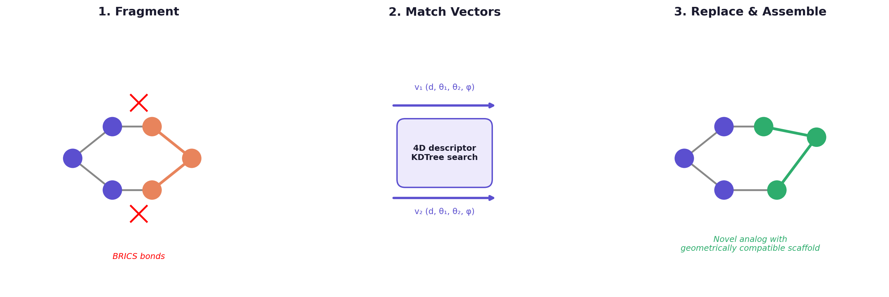

# CAVEAT

**Open-source fragment-based bioisosteric replacement tool.**

A modern reimplementation of the CAVEAT algorithm (Lauri & Bartlett, *J. Comput. Aided Mol. Des.* 1994), which identifies bioisosteric fragment replacements by matching 3D attachment vector geometry across a database of protein-bound ligand fragments.

<p align="center">
  
</p>
<p align="center">
  <em>The CAVEAT approach: fragment a molecule at retrosynthetically meaningful bonds, compute geometric descriptors from the 3D attachment vectors, then search a fragment database for replacements with compatible geometry — enabling scaffold hops grounded in protein-ligand interaction patterns.</em>
</p>

---

## Why Reproduce CAVEAT?

The original CAVEAT was a closed-source tool that pioneered the idea of geometry-aware fragment replacement for drug design. The concept — that fragments occupying similar 3D vector space in a binding site can substitute for each other — remains fundamental to bioisosteric design, but the tool itself has been unavailable for decades. This reimplementation makes the method:

- **Transparent**: every step from fragmentation to geometric matching to assembly is readable Python
- **Extensible**: swap in different fragmentation schemes, distance metrics, or scoring functions
- **Reproducible**: pip-installable with tests, usable as a library or CLI
- **Scalable**: SQLite + KDTree indexing handles databases of millions of fragments

## How It Works

1. **Fragment** molecules at retrosynthetically meaningful bonds (BRICS decomposition via RDKit)
2. **Compute geometric descriptors** for each fragment's attachment vectors: (distance, angle₁, angle₂, dihedral) — following the original CAVEAT parameterization
3. **Index** fragments in a KDTree over normalized 4D descriptor space for fast nearest-neighbor search
4. **Query**: given a molecule and a substructure to replace, find database fragments with compatible attachment vector geometry
5. **Assemble**: stitch replacement fragments into the parent molecule, generating novel analogs

## Quick Start

```bash
# Setup
conda env create -f environment.yml
conda activate caveat
pip install -e ".[dev]"

# Build a fragment database from ChEMBL molecules
caveat build --input data/chembl_sample.smi --db fragments.db --n-confs 10

# Query: find replacements for N-methylpiperazine in imatinib
caveat query --db fragments.db \
  --mol "CC1=C(C=C(C=C1)NC(=O)C2=CC=C(C=C2)CN3CCN(CC3)C)NC4=NC=CC(=N4)C5=CN=CC=C5" \
  --replace "CN1CCNCC1" \
  --top 10

# Database statistics
caveat info --db fragments.db
```

## Repository Structure

```
caveat/
├── caveat/
│   ├── fragment.py      # BRICS fragmentation engine
│   ├── geometry.py      # 3D bond vector descriptors (CAVEAT parameterization)
│   ├── database.py      # SQLite fragment database with KDTree indexing
│   ├── query.py         # Geometric nearest-neighbor query engine
│   ├── assemble.py      # Fragment stitching into parent molecules
│   └── cli.py           # CLI: build, query, info
├── data/
│   ├── chembl_sample.smi   # ~150 diverse drug-like molecules
│   └── chembl_5k.smi       # 5,000 ChEMBL drug-like molecules
├── scripts/                 # Screening and visualization workflows
├── tests/                   # pytest suite
└── environment.yml
```

## Dependencies

- Python 3.10+
- RDKit, NumPy, SciPy, Click
- SQLite (built-in)

## References

- Lauri & Bartlett. "CAVEAT: A Program to Facilitate the Design of Organic Molecules." *J. Comput. Aided Mol. Des.* 8, 51–66 (1994).
- Degen et al. "On the Art of Compiling and Using 'Drug-Like' Chemical Fragment Spaces." *ChemMedChem* 3, 1503–1507 (2008). [BRICS]

## License

MIT
